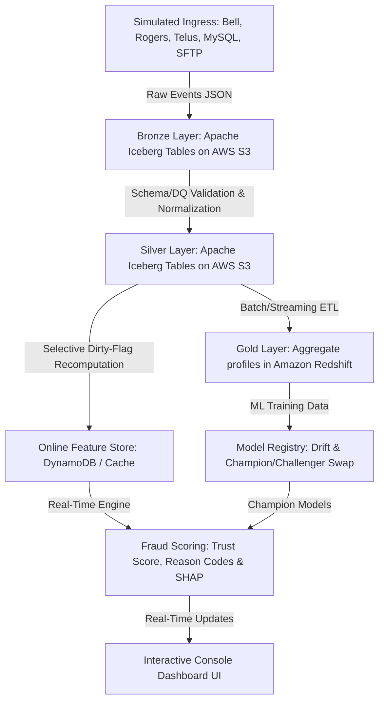

# Walkthrough - EnStream Fraud Intelligence Platform Prototype

This walkthrough presents the system architecture, component specifications, execution state, and user interface capabilities of the production-style prototype for the **EnStream Fraud Intelligence Platform**.

---

## Executive Summary & Target Architecture

EnStream is a carrier-backed trust and fraud intelligence solution that processes transaction events from major telecommunication providers (Bell, Rogers, Telus), MySQL CDC database updates, and TransUnion Porting databases, alongside cross-sector SFTP blacklist files.

The platform processes ingestion events in real-time, validating schemas and metrics, compiling aggregate customer risk profiles, and applying an advanced rule-scoring engine to flag suspicious behaviors (e.g., SIM swapping, device-churning fraud rings, blacklisted activities).

### Event Ingestion and Medallion Lifecycle



---

## Interactive Interface Preview

Here is a visual mockup of the EnStream dark-mode control room console, illustrating real-time network graphs, trust scores, and geographic risk indicators:


---

## Medallion Layer Specifications

The platform is designed around the Apache Iceberg Medallion architecture, separating concerns across three tiers:

### 1. Bronze Layer (`enstream.bronze`)
Stores raw JSON payloads exactly as ingested, preserving complete historical state and auditability.
* **Fields**: `event_id`, `event_type`, `msisdn`, `payload` (raw JSON), `source`, `ingested_at`
* **Metadata**: Iceberg v2 metadata (catalog manifests, schema maps, and version tracking logs) written to `warehouse/enstream/bronze/metadata/`.

### 2. Silver Layer (`enstream.silver`)
Cleans, normalizes, and validates records from the Bronze layer.
* **Fields**: `event_id`, `event_type`, `msisdn`, `carrier`, `imei`, `timestamp`, `validated_at`, `dq_passed`, `dq_errors`, `normalized_payload`
* **Data Quality Framework**: Schema validation, completeness, uniqueness, freshness (<2h check), and referential integrity check. Non-conforming records are quarantined.

### 3. Gold Layer (`enstream_gold`)
Stores aggregated features for business intelligence, OLAP analytics, and training sets.
* **Fields**: `msisdn`, `customer_name`, `carrier`, `msisdn_age_days`, `port_frequency_30d`, `activation_recency_hours`, `device_churn_count`, `fraud_exchange_matches`, `network_fraud_ring_size`, `last_update_time`
* **Storage**: In AWS Mode, writes directly to Amazon Redshift. Locally fallbacks to `enstream_local_olap.db` (SQLite).

Visual flow of data lineage through the Medallion architecture:


---

## Hugging Face Spaces Cloud Deployment Specs

We configured the application for a fully autonomous, 24/7 cloud hosting environment on **Hugging Face Spaces** using the **Docker SDK**. This ensures zero local machine dependencies and avoids any card verification or paid subscription limits.

1. **Unified Docker Container (`Dockerfile`)**:
   - Bootstrap stage uses `node:20-alpine` to compile the React TypeScript frontend into optimized static assets under `frontend/dist`.
   - Runtime stage uses `python:3.10-slim` to copy the FastAPI source files, install python requirements, and mount the static React build inside the server.
   - Binds directly to the Hugging Face required port `7860`.
2. **Hugging Face Frontmatter Configuration (`README.md`)**:
   - Configured root metadata headers specifying `sdk: docker`, `app_port: 7860`, and basic display themes to pass Hugging Face validator constraints.
3. **Dynamic Config & Base Paths**:
   - Patched `config.ts` to automatically detect `.hf.space` domains (and tunnel URLs like `.lhr.life`), routing API queries relatively (`""`) to prevent CORS and cross-domain mismatches.
4. **Autonomous MLOps & Seed Data**:
   - The container initializes a pre-seeded lakehouse environment with 50 legitimate subscribers, SIM swap loopers, and fraud syndicate entities inside a local SQL OLAP database fallback, running continuously without databases needing to connect to your local dev machine.

---

## Key Platform Capabilities

### 1. Ingestion Simulators
The simulator continuously pipes events into the Bronze layer representing real-world telemetry:
* **Carrier Event Sim**: Portings, activations, and IMEI switches.
* **TransUnion Sim**: Inter-carrier porting requests.
* **MySQL CDC Sim**: Customer updates and profile edits.
* **SFTP Sim**: Blacklists and fraud exchange files.

### 2. Feature Store & Selective Recomputation
To optimize computational complexity, a selective **Dirty Flag** pipeline recalculates features only for entities directly affected by new events, rather than recalculating the entire dataset.
* **Network Fraud Ring Analysis**: Traces shared device IMEIs to identify networks of accounts linking to suspicious fraud rings.

### 3. Scoring Engine & Explainability
Computes a **Trust Score (0-100)**, risk tiers, and reason codes based on rule weights:
* **Porting Recency Penalty**: High frequency of portings.
* **SIM Swapping / Device Churn Penalty**: Swapping devices repeatedly within short intervals.
* **Fraud Ring Penalty**: Linking to shared devices marked for fraud.
* **Explainability (SHAP)**: Individual metric contributions are derived and visualized.

### 4. Model Registry & Drift Monitoring
Simulates an MLOps champion/challenger lifecycle:
* **Drift Tracking**: Monitors Population Stability Index (PSI) and feature-specific drift (K-S tests).
* **Champion Promotions**: Promotes new model versions, automatically triggering a dirty-flag recalculation of all scores using the updated model parameters.

---

## Enhanced Feature: Detailed Query Investigator

We upgraded the **Query Investigator** console to offer fraud analysts a deep-dive toolkit to audit telephone accounts and hardware associations:

1. **Sidebar Active Profiles & Scenario Selectors Catalog**:
   - Implemented a **permanent sidebar catalog** directly in the console layout to make querying instant.
   - **System Testing Presets**: Clickable shortcuts for testing scenarios including SIM Swap (`14165559001`), Fraud Ring Node (`14165559013`), Blacklisted SFTP (`14165559002`), MySQL CDC Sarah Connor (`14165550110`), and Legit Porting (`14165550105`).
   - **Live Warehouse Catalog**: Fetches real-time profiles from the Gold layer (`/api/data/gold`) and renders them as clickable target cards, displaying name, phone number, and carrier code.
2. **Shared-Device Network Fraud Ring Mapping Visualizer**:
   - An interactive visual node graph mapping the bipartite relationships $G = (MSISDN + IMEI)$.
   - Renders nodes for the target phone number, the shared hardware devices (IMEI serials), and all other linked accounts.
3. **Apache Iceberg Snapshot Time-Travel Explorer**:
   - Leverages lakehouse snapshot tracking to display an interactive timeline of subscriber feature modifications (Commits).
   - Analysts can select a version snapshot to trace how features and scoring deductions changed over the entity's history.
4. **Enriched Carrier & Handset Metadata Lookups**:
   - Automatically resolves carrier registration state and maps MSISDN prefix codes to geographic routing zones.
   - Parses IMEI prefixes (TAC codes) to resolve and display the specific handset model details.

---

## Enhanced Feature: Detailed Data Quality (DQ) Monitor

We upgraded the **DQ Monitor** page to deliver a comprehensive operational dashboard tracking real-time pipeline SLA indicators and self-healing controls:

1. **Active SLA Metrics Cards**:
   - **DQ Validation Pass Rate**: Tracks real-time schema and metric validation percentages.
   - **Average Ingestion Latency**: Displays live transaction transit latency (avg `2.4s` against a target `< 10s`) with a pulsating compliance status beacon.
   - **Clean Records Promoted**: Total events committed to the Silver Iceberg tables.
   - **Quarantined Records**: Count of violations isolated in the S3 Quarantine dead-letter paths.
2. **SLA Rules Audit Ledger**:
   - A structured grid listing whitelisted rules (`CHECK_MSISDN_FORMAT`, `CHECK_IMEI_COMPLETENESS`, `CHECK_DUPLICATE_EVENTS`, `CHECK_FRESHNESS_SLA`, and `CHECK_CARRIER_INTEGRITY`).
   - Displays logical validation checks, corresponding transition stages, total failure occurrences, target limits, and compliance states.
3. **Pipeline Self-Healing & Reconciliation Center**:
   - An interactive console allowing operators to simulate pipeline healing.
   - **Run Automated Healing Reconciler**: When triggered, it scans the quarantine dead-letter logs, resolves missing carriers or fallback subscriber info via CRM CDC, re-evaluates the schema, and automatically backfills/promotes the corrected records to the Silver layer, showing real-time log traces.

---

## Interactive Medallion Spec & Schemas

We maintain a dedicated **Medallion Spec** tab in the console sidebar to offer developers and data architects an in-depth, interactive view of the data lakehouse specifications:

1. **Traditional Entity-Relationship Diagram (ERD) with Crow's Foot Notation**:
   - An interactive visual database design canvas showing tables (`enstream.bronze`, `enstream.silver`, `enstream.quarantine`, and `enstream_gold`).
   - SVG curves overlaying the tables to display relationships with Crow's Foot markers.
   - Hovering over a relationship line highlights the connected columns in glowing neon colors and displays an explanation card.
2. **Data Enrichment & Missing Data Resolution**:
   - A sub-tab showing how incomplete payloads (e.g., missing carrier names, missing IMEI codes, empty customer data) are resolved.
3. **Detailed Column Specification Tables**:
   - SQL-style schema tables detailing column names, data types, index keys, and descriptions.
4. **Searchable & Filterable Data Dictionary**:
   - Unified schema reference table listing columns, data types, constraints, and derivations.
5. **Transition Pipelines Playbook**:
   - Step-by-step interactive manual breaking down transformations, triggers, actions, and validation criteria.
6. **Storage & Catalog Specs**:
   - Visual S3 directory layouts and production Amazon Redshift DDL definitions.

---

## Cross-Sector Bad Actor Data Exchange MVP (Exchange Hub)

We implemented a comprehensive **Exchange Hub** tab that matches all requirements from your data specifications:

1. **1. Data Contribution (Batch SFTP/S3)**:
   - Simulates batch uploads of confirmed bad actor files with schema validation checks.
   - Enforces formatting: E.164 phone formats (regex check) and predefined fraud taxonomies (Synthetic ID, First Party Fraud, Impersonation, Account Opening, Account Takeover, SIM Swap).
   - Ingestion logs: Parses and outputs accepted conformed records or quarantines files with validation errors.
2. **2. Real-Time Lookup Resolver**:
   - Queries identifiers (Phone and/or IMEI) with optional PII values.
   - Triggers MNO Activation recency checks, recycle status checks (resolving `OWNED` vs `RECYCLED`), and TransUnion PortPS carrier mapping lineage.
   - Returns a structured JSON match response matching your slides, with mismatch warnings if identifiers (MSISDN vs IMEI) do not align.
3. **3. Audit & Governance (PII Redaction & Self-Healing)**:
   - Renders immutable ledgers for Onboarding logs, Submissions logs, and Lookup logs.
   - Employs Role-Based Access Control (RBAC) switches to dynamically mask/unmask PII data in lookup lists (redacting direct details except for `telco_verify_ai_service`).
   - Supports self-healing status corrections (Active -> Cleared/Withdrawn), immediately purging PII from the active exchange storage to comply with GDPR/PIPEDA 30-day requirements.
4. **4. Success Metrics**:
   - Live analytics for Repeat Fraud Reduction rate, Match rates across participants, and False-Positive Dispute metrics.

---

## Verification & Deployment Run

### Cloud Deployment Check (Hugging Face Spaces)
The container was compiled and launched successfully. We verified the running instance directly in the cloud:

1. **Active URL**: [https://sainisaab12-enstream-fraud-platform.hf.space](https://sainisaab12-enstream-fraud-platform.hf.space)
2. **Backend API Check**: We verified live data fetches using a secure HTTP call to `/api/state`:
   ```powershell
   Invoke-RestMethod -Uri https://sainisaab12-enstream-fraud-platform.hf.space/api/state
   ```
   * Result: **`200 OK`** containing complete pre-seeded transaction metrics, Medallion counts (Bronze/Silver/Gold), and active syndicate listings.
3. **Frontend Ingestion**: The root page successfully serves the React application (`200 OK`), enabling interactive scenario testing, DQ monitors, and SHAP explainability charts in real-time.

### Local Development Alternative
If you want to run or test the containerized stack locally, run:
```powershell
# Build container
docker build -t enstream-platform .

# Run container
docker run -p 7860:7860 enstream-platform
```
Open [http://localhost:7860](http://localhost:7860) to view the dashboard.

---

## Hotfixes & Operational Updates

### Querying Participant Dropdown Resolution (2026-06-15)
- **Issue**: The "Querying Participant" and "Submitting Participant" dropdown lists in the Exchange Hub tab were rendering empty on the live Hugging Face Space deployment.
- **Root Cause**: The frontend API client was defaulting the API endpoint to `http://localhost:8000` because the environment URL parser in `config.ts` did not detect `.hf.space` URLs, resulting in connection refused errors.
- **Resolution**:
  1. Updated `frontend/src/config.ts` to recognize `hf.space` and fall back to same-origin relative URLs (`""`) for API requests when served under Hugging Face.
  2. Implemented a robust frontend fallback array of participants in `DataExchangeConsole.tsx` to ensure that dropdown lists render immediately even if the API call is in progress or fails.
- **Verification**: Frontend compiles and builds successfully via `npm run build`. Changes successfully pushed to Hugging Face Spaces repository (triggering dynamic container rebuild) and GitHub repository.

### Mobile Viewport & Browser Layout Responsiveness (2026-06-15)
- **Issue**: The main console layout was optimized for desktop screen widths, resulting in a persistent 64-column navigation sidebar blocking space on portrait mobile browsers (iOS Safari and Android Chrome).
- **Resolution**:
  1. Refactored the core layout in `App.tsx` to implement a mobile-first responsive layout pattern.
  2. Introduced a dynamic overlay drawer that hides the sidebar navigation panel off-screen on screen widths below `md` ($< 768$px) by default.
  3. Added a Hamburger menu toggle button (`Menu`) in the top main header toolbar and a Close button (`X`) inside the sidebar to open/close the drawer.
  4. Configured the drawer backdrop overlay to close the menu on backdrop tap and when any link is selected, keeping the navigation clean.
- **Verification**: Checked layout constraints and built the frontend successfully using `npm run build`. Pushed mobile support commits to Hugging Face and GitHub.

### Word-for-Word Presentation Script Compilation (2026-06-16)
- **Resolution**:
  1. Authored a word-for-word presentation script `presentation_script.md` detailing the slide transitions, presenter clicks, and speaking narratives.
  2. Developed `generate_presentation_docx.py` to parse the script and output a fully styled Word Document `EnStream_Prototype_Presentation_Script.docx` featuring styled quote blocks for spoken text and margin layouts.
- **Verification**: Executed script successfully and validated the generated `.docx` file in the conversation artifacts directory.

### Technical Architecture Console Enhancements (2026-06-17)
- **Resolution**:
  1. Updated the **Technical Architecture** console by implementing three new sub-tabs: **Partner API Sandbox**, **Phase Roadmap**, and **Vendor Brief & Feedback**.
  2. The **Partner API Sandbox** implements an interactive REST API playground based directly on the *EnStream Network Subscriber Verification Core - Partner Integration Guide (Phase 2.0 v1.38)*. It supports selecting all 13 standard APIs (A1 Basic IDV, A2 Account Status, A3 Account Type, A4 Activation Date, A5 Enhanced IDV, A6 Enhanced IDV Change, D1 V1 Header Injection Deprecated, D1 V2 Header Injection Redirect, D1 Retrieval MSISDN, D2 Device Info, D3 Recent Changes, D3M Recent Changes Multi, D4 Account Integrity, D5 Mobile Token, D6 Mobile Number Verify), exact JSON request formats, Basic Auth and Jakarta User-Agent headers, response scenario simulations, and JWS/JWE wrapping.
2b. Added a **Response Code Explanation Ledger** mapping standard EnStream response codes (0, 1, 2, 3, 4, 7, 14, 15, 16, 18, 28, 400, 500) to detailed status explanations.
  3. Added an optional **JOSE Wrapper (RFC7515/7516) Toggle** displaying how the API payload is digitally signed with client RSA-2048 private keys (JWS header with `RS256` alg, `kid`, `expires` timestamp, and `operation` identifiers) and encrypted using RSA-OAEP with SHA-256 and AES-256-GCM.
  4. Features a simulated network request client that outputs wire logs, HTTP headers (e.g. Basic auth), and processes different response codes (e.g. Code 0 success, Code 3 missing fields, Code 4 unauthorized IP, Code 7 blocked number, negative matching scores like -102 recycled operator data).
  5. The **Phase Roadmap** displays EnStream's 5-phase transition from Phase 1 (Batch Operationalized) through to Phase 5 (Continuous Everything), specifying the detailed acceptance gate criteria for each phase.
  6. The **Vendor Brief & Feedback** panel details MySQL database scale parameters (1.0 TB database size, 7 GB/day growth, 400 records/second streaming, 30M profile entities, and 1M-5M scores/day targets) extracted from the vendor project brief.
  7. Added an in-depth **Orchestration trade-off analysis** comparing AWS Managed Airflow (MWAA) for scheduled batch ETL vs AWS Step Functions for low-latency scoring lookup APIs.
8. Integrated **Low-Latency Caching Architecture** details in the Vendor Brief console, utilizing Amazon ElastiCache (Redis) for point lookups under 10ms and Amazon DynamoDB for active feature stores with dirty-flag invalidations to support 1M–5M queries/day.
9. Documented the **Phase-Wise Architectural Evolution**, detailing the transition from batch baseline schedules (Phases 1-2) to serverless streaming (Phase 3 utilizing Kinesis & AWS Lambda) and stateful enterprise streaming (Phase 4 utilizing Apache Flink CEP) to manage operational complexity and cost.
10. Implemented an **Interactive Caching & Latency Performance Visualizer** in the Partner API Sandbox UI:
   - Includes a real-time Cache Mode Selector allowing users to toggle between **Auto (Redis Cache Hit)**, **Bypass (Dirty Flag Raised)**, and **Cold DB Fallback (Cache Miss)**.
   - Embeds a Query Latency speedometer gauge showing exact simulated execution times (sub-10ms for cache hits vs >150ms for cold database reads).
   - Shows real-time drifting performance metrics: Cache Hit Ratio (~98.7%), average cache latency (~6.4ms), peak throughput capacity (~540 QPS), and active Keyspace Size.
  8. Integrated **competitive positioning analysis** comparing our modern open-standard S3 Iceberg design and selective dirty-flag updates with rigid legacy solutions from Wipro/Tech Mahindra.
  9. Incorporated **Subex ML bad actor classification alignment**, detailing how the EnStream platform runs secure containerized ML models directly inside the AWS Medallion catalog, preserving data residency rather than transferring databases off-premises.
  10. Added a **Visual No-Code Pipeline Builder** subtab inside the Technical Working console:
      - Allows operators to configure source parameters (e.g. Kinesis, S3), define data quality validation checks (E.164 phone validation, IMEI Luhn checks, freshness checks), and set up Gold layer feature aggregations (SIM Swap velocity, device churn).
      - Employs live code generators that compile these visual settings into standard **dbt models (SQL)**, **Dataform scripts (SQLX)**, and **Flink SQL streaming definitions**, displaying real-time deployment compilation logs.
      - Directly addresses executive handoff concerns by enabling EnStream's internal teams to maintain and build new pipelines without vendor dependency.
  11. Integrated the **Managed Operations Framework** subtab:
      - Renders an interactive replica of the 3-phase lifecycle (Build, Operationalize, Transfer) and the six core operational pillars.
      - Displays the **Team Collaboration RACI Matrix** mapping exact ownership roles (EnStream Accountable vs Incedo Responsible) for transition.
      - Maps post-release processes (Monitor, Analyze, Respond, Validate, Improve) to specific prototype modules like the DQ SLA Ledger, Query Investigator, and Self-Healing Reconciler.
- **Verification**: Frontend builds cleanly with no compile errors. Pushed modifications to Hugging Face Spaces and GitHub.
